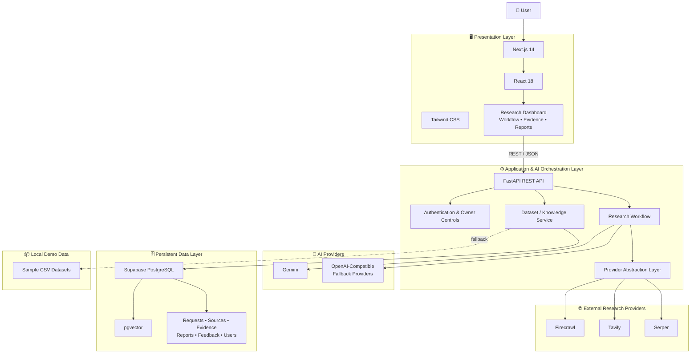
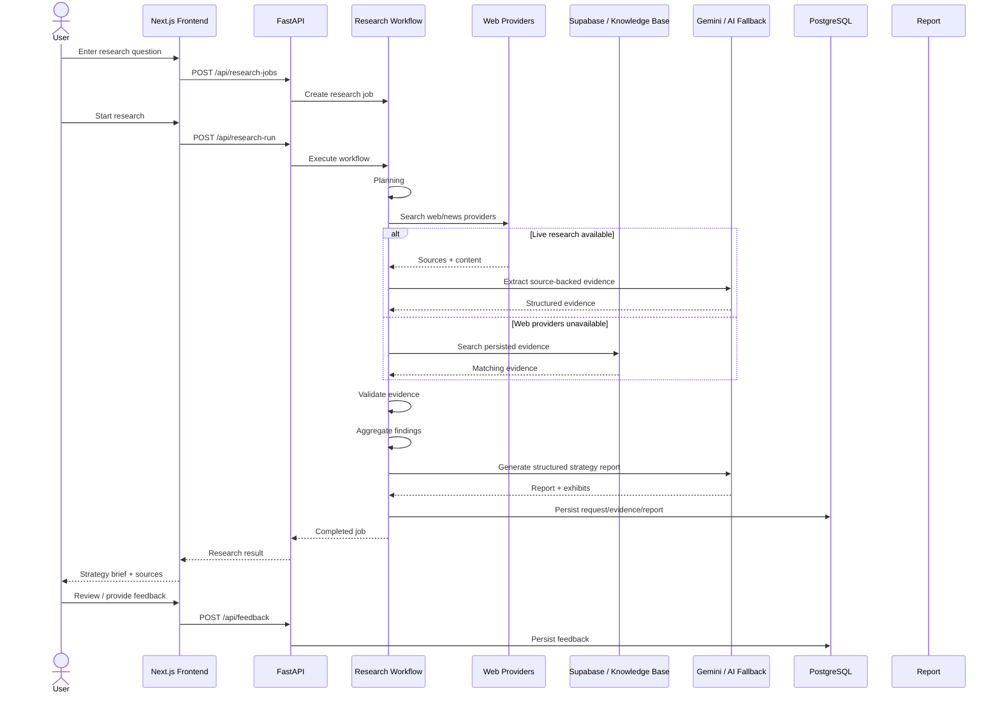
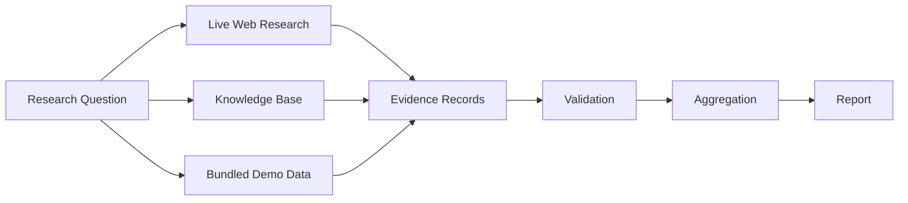
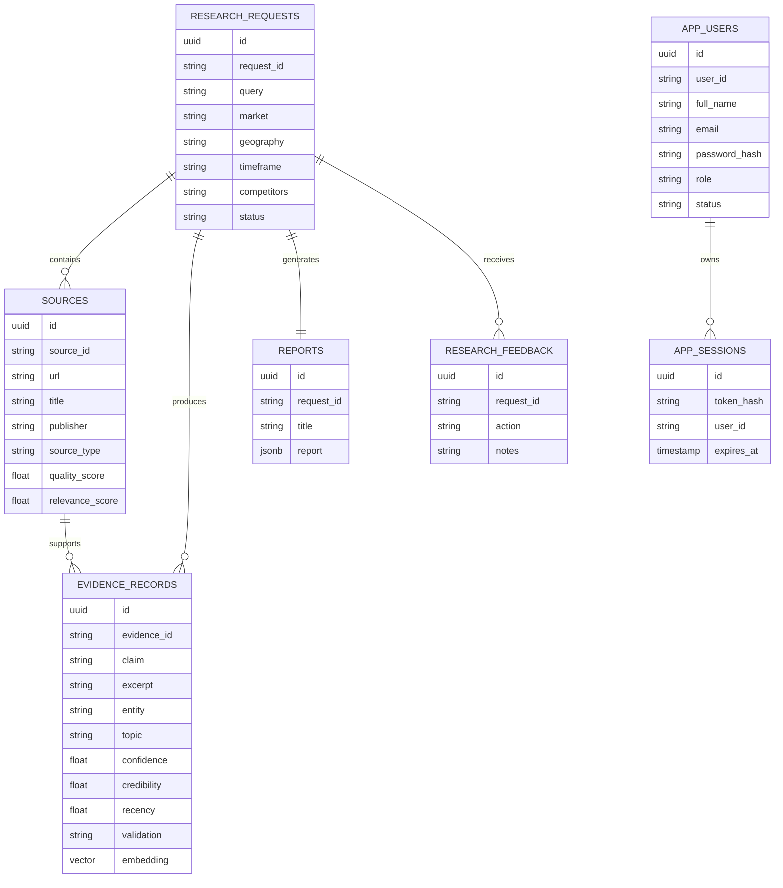
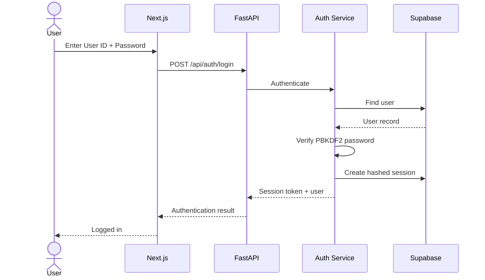
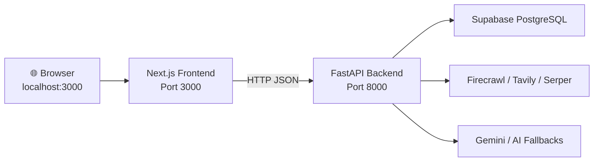
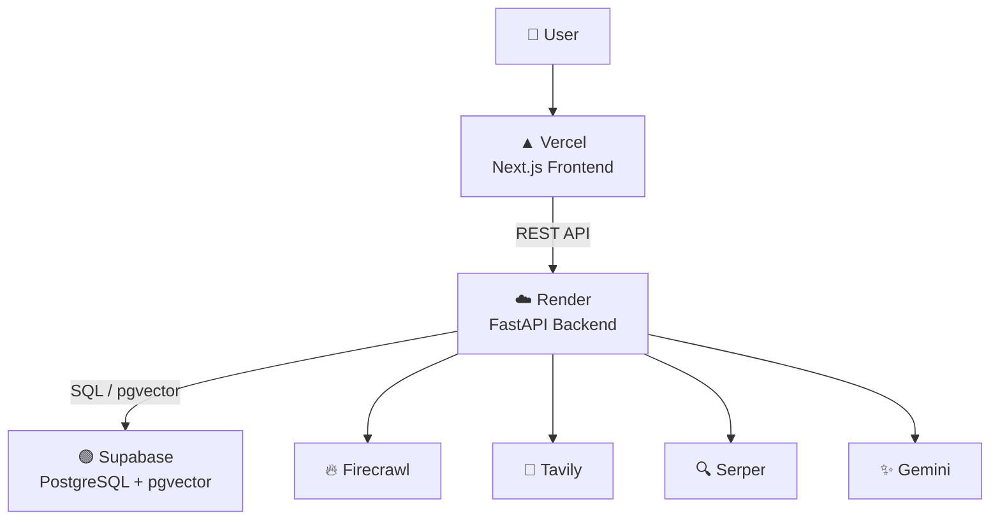

# 🧠 McKinsey AI Market Research & Strategy Engine

> **An evidence-backed AI market research platform that turns a business question into a structured research plan, gathers web or knowledge-base evidence, validates findings, synthesizes strategic insights, and produces a consultant-style research brief for human review.**

[](./frontend)
[](./backend)
[](./deployment/supabase)
[](./deployment/supabase/schema.sql)
[](./backend/services/providers.py)
[](./DEPLOYMENT.md)

**Live frontend:** https://mckinsey-ai-market-research-engine.vercel.app/

---

## 📌 Table of Contents

- [Project Overview](#-project-overview)
- [Problem Statement](#-problem-statement)
- [Key Capabilities](#-key-capabilities)
- [How the System Works](#-how-the-system-works)
- [System Architecture](#-system-architecture)
- [End-to-End Research Flow](#-end-to-end-research-flow)
- [Research Workflow Stages](#-research-workflow-stages)
- [AI and Provider Strategy](#-ai-and-provider-strategy)
- [Evidence and Knowledge Architecture](#-evidence-and-knowledge-architecture)
- [Report Generation](#-report-generation)
- [Application Architecture](#-application-architecture)
- [Technology Stack](#-technology-stack)
- [Repository Structure](#-repository-structure)
- [Database Architecture](#-database-architecture)
- [Authentication and Authorization](#-authentication-and-authorization)
- [API Reference](#-api-reference)
- [Environment Configuration](#-environment-configuration)
- [Prerequisites](#-prerequisites)
- [Local Development Setup](#-local-development-setup)
- [Running the Application](#-running-the-application)
- [Testing](#-testing)
- [Deployment Architecture](#-deployment-architecture)
- [Security Guidelines](#-security-guidelines)
- [Troubleshooting](#-troubleshooting)
- [Design Decisions](#-design-decisions)
- [Current Limitations](#-current-limitations)
- [Future Improvements](#-future-improvements)
- [Documentation](#-documentation)
- [Contributing](#-contributing)
- [Project Status](#-project-status)

---

# 📖 Project Overview

The **McKinsey AI Market Research & Strategy Engine** is a full-stack AI research application designed to accelerate market research and strategy analysis.

A user starts with a business question such as:

> *“What are the major growth opportunities and competitive risks in the Indian digital healthcare market?”*

The platform transforms that question into a repeatable research pipeline:

```text
Business Question
       │
       ▼
Research Intake
       │
       ▼
Planning
       │
       ▼
Web / Knowledge-Base Research
       │
       ▼
Evidence Extraction
       │
       ▼
Evidence Validation
       │
       ▼
Aggregation & Knowledge Synthesis
       │
       ▼
AI Report Generation
       │
       ▼
Human Review
       │
       ▼
Consultant-Style Strategy Brief
```

The project is intentionally designed around **source traceability, evidence quality, provider resilience, and human review** rather than presenting unrestricted LLM output as authoritative research.

---

# 🎯 Problem Statement

Traditional market research often requires researchers to manually:

1. Define research questions.
2. Break questions into research tasks.
3. Search many sources.
4. Read and extract evidence.
5. Validate claims.
6. Organize findings.
7. Compare market and competitor signals.
8. Build an executive-level report.

This project automates much of that workflow while keeping the evidence and source trail visible.

### Core objective

> **Reduce the time required to move from a strategic question to a structured, evidence-backed research brief without hiding the underlying evidence.**

---

# 🚀 Key Capabilities

## 📝 1. Research Intake

Users can provide:

- Research question
- Market
- Geography
- Timeframe
- Competitors
- Deliverable/output format
- Report depth

The backend converts the request into a structured research job.

---

## 🧭 2. Automated Research Planning

The planner breaks a business question into focused research tasks, including:

- Market signals
- Competitor observations
- Recent strategic developments
- Risks and regulatory developments

Example:

```text
Question
   │
   ├── Market size / growth / trends
   ├── Competitor strategy / pricing / technology
   └── Recent developments / risks / regulation
```

---

## 🌐 3. Multi-Provider Web Research

The backend supports multiple research providers:

| Provider | Role |
|---|---|
| **Firecrawl** | Primary web/news search and retrieved page content |
| **Tavily** | Alternative web research provider |
| **Serper** | Alternative search provider |

The provider layer normalizes results into a common internal structure.

This allows the workflow to continue even when one provider is unavailable.

---

## 🧠 4. LLM-Based Evidence Extraction

When an AI provider is available, Gemini receives retrieved source content and is instructed to extract only claims directly supported by those sources.

Evidence records include fields such as:

- Claim
- Source URL
- Date
- Entity
- Topic
- Excerpt
- Confidence

The extraction prompt explicitly discourages unsupported facts and invented numbers.

---

## 🛡️ 5. Evidence Validation

Extracted evidence is evaluated for:

- Credibility
- Recency
- Duplicate status
- Contradiction status
- Confidence

Evidence is then separated into validated evidence and items requiring review.

---

## 🗄️ 6. Knowledge Base / Database Mode

When live web research is unavailable, the system can use persisted evidence from:

- Supabase PostgreSQL
- Bundled CSV data in demo mode

This provides a graceful degradation path rather than immediately failing the research request.

---

## 🔎 7. Evidence Search and Review

The application exposes searchable evidence and source libraries.

Users can filter evidence by:

- Market
- Topic
- Validation status
- Search text

Evidence can also be updated through the backend review API.

---

## 📊 8. Dashboard Analytics

The data layer provides aggregated metrics such as:

- Research request count
- Source count
- Evidence count
- Validated evidence
- Completed/running/pending jobs
- Evidence requiring review
- Average confidence
- Top topics
- Top entities
- Evidence by year
- Market metrics

The frontend uses these outputs to power the strategy intelligence dashboard.

---

## 📑 9. Consultant-Style Report Generation

The report structure supports:

- Title and subtitle
- Executive summary
- At-a-glance metrics
- Key findings
- Market signals
- Competitor observations
- Implications
- Strategic directions
- Executive actions
- Exhibits/charts
- Limitations
- Source citations
- Human-review flag

The report-generation prompt requires quantitative exhibits to be based only on supplied evidence.

---

## 👤 10. Centralized Authentication

The platform includes:

- User registration
- User ID + password login
- Session management
- Profile updates
- Owner account
- User administration
- Suspend/reactivate users
- Delete non-owner users
- Revoke user sessions

Passwords are stored using PBKDF2-SHA256 hashing.

---

# 🏗️ System Architecture

The current project uses a **three-layer application architecture** with external research/AI providers and Supabase as the persistent data layer.



### Architecture at a glance

| Layer | Responsibility |
|---|---|
| **Frontend** | User interface, research intake, workflow monitoring, evidence review, dashboards, reports |
| **FastAPI Backend** | REST API, authentication, workflow orchestration, data access, provider coordination |
| **Research Providers** | Discover external web/news sources |
| **AI Providers** | Extract evidence and generate structured reports |
| **Supabase PostgreSQL** | Persistent application, research, evidence, report, feedback, and authentication data |
| **pgvector** | Vector storage and similarity-search infrastructure |
| **CSV fallback** | Demo/offline data source when a database is unavailable |

---

# 🔄 End-to-End Research Flow



---

# 🔬 Research Workflow Stages

The backend workflow is implemented in `backend/agents/workflow.py`.

## Stage 1 — Intake

The research job is created with:

```text
Query
Market
Geography
Timeframe
Competitors
Deliverable
Report depth
```

The job begins in the intake state.

---

## Stage 2 — Planning

The planner creates focused research tasks.

```text
Research Question
      │
      ├── Market Signals
      ├── Competitor Observations
      └── Strategic Developments / Risks
```

---

## Stage 3 — Browsing

The system executes provider searches concurrently using a thread pool.

The workflow:

1. Creates search tasks.
2. Sends searches to the research-provider abstraction.
3. Deduplicates URLs.
4. Limits source count.
5. Captures source title, URL, provider, snippet/content and retrieval date.

### Fast Research Mode

The environment supports:

```env
FAST_RESEARCH_MODE=true
MAX_RESEARCH_SOURCES=9
MAX_EVIDENCE_RECORDS=30
```

This keeps research bounded and suitable for interactive application use.

---

## Stage 4 — Extraction

For live research, source content is sent to the configured AI provider using a structured JSON schema.

The extraction schema contains:

```text
claim
source_url
date
entity
topic
excerpt
confidence
```

The system instructs the model to extract only claims directly supported by supplied sources.

---

## Stage 5 — Validation

Each evidence record receives validation attributes such as:

```text
credibility
recency
duplicate
contradiction
confidence
validation
```

The current workflow uses `pass` and `review` as the primary validation states.

---

## Stage 6 — Aggregation

Validated evidence is grouped by:

- Topic
- Entity

The workflow produces an aggregation object containing evidence counts, topic groups, and distinct entities.

---

## Stage 7 — Report Generation

The system generates a structured strategy report from validated evidence.

The report schema supports exhibits:

```text
bar
line
donut
```

Charts are only requested when the evidence contains sufficient quantitative information.

---

## Stage 8 — Human Review

The final workflow state is `review`.

The report explicitly contains:

```json
{
  "human_review_required": true
}
```

This makes human verification part of the product workflow rather than an optional afterthought.

---

# 🤖 AI and Provider Strategy

## Provider abstraction

External providers are isolated inside:

```text
backend/services/providers.py
```

The main provider functions include:

```text
Firecrawl
   │
   ├── web search
   └── news search

Tavily
   └── alternative search

Serper
   └── alternative search
```

The application exposes:

```text
GET /api/providers/status
```

to report configured provider availability.

---

## LLM resilience

The AI provider layer supports:

- Gemini primary model
- Configurable Gemini fallback model
- Bounded retries
- Exponential backoff
- Jitter
- Timeout configuration
- Alternative LLM providers
- Evidence-only degradation when AI synthesis is unavailable

### Retry behavior

Transient errors such as network failures and selected HTTP errors are retried.

Quota exhaustion is treated differently: the application can stop retrying and use its evidence fallback instead of wasting time waiting on a quota that cannot recover immediately.

---

# 🧩 Evidence and Knowledge Architecture

The project has three practical evidence paths.



## Live evidence

Retrieved from external research providers.

## Database knowledge

Persisted evidence stored in Supabase PostgreSQL.

## Demo evidence

Bundled CSV files under:

```text
data/
├── sample_research_requests.csv
├── sample_sources.csv
├── sample_evidence_records.csv
└── sample_market_metrics.csv
```

---

## Vector infrastructure

The Supabase schema includes:

```sql
embedding vector(1536)
```

and an IVFFlat index:

```sql
idx_evidence_embedding
```

A database RPC is also defined:

```text
match_evidence(...)
```

and exposed through:

```text
POST /api/data/semantic-search
```

### Important implementation note

The current research workflow's fallback knowledge retrieval in `DatasetStore.search_research_evidence()` is **keyword-based SQL/CSV retrieval**. The vector infrastructure is available through the database schema and semantic-search endpoint, but the ZIP does not implement an automatic embedding-generation pipeline that feeds every research query into pgvector.

That distinction is documented here intentionally so the README reflects the current implementation rather than an intended future design.

---

# 📑 Report Generation

The live report schema is designed around executive communication.

```text
Strategy Brief
│
├── Title
├── Subtitle
├── Report Date
├── Executive Summary
│
├── At a Glance
│
├── Key Findings
│
├── Market Signals
│
├── Competitor Observations
│
├── Implications
│
├── Strategic Directions
│
├── Executive Actions
│
├── Exhibits
│   ├── Bar
│   ├── Line
│   └── Donut
│
├── Limitations
│
└── Source Citations
```

The generation prompt specifically instructs the model to:

- Use validated evidence.
- Keep descriptive facts separate from strategic interpretation.
- Preserve source URLs.
- Avoid inventing facts.
- Avoid inventing numerical values.
- Produce charts only when supported by quantitative evidence.
- Return no exhibit when the evidence is insufficient.

---

# 🖥️ Application Architecture

## Frontend Layer

The frontend is implemented with:

- Next.js
- React
- Tailwind CSS
- TypeScript
- Lucide React icons

Primary application functionality includes:

```text
Research Dashboard
│
├── New Research
├── Research Workflow
├── Research Jobs
├── Sources & Library
├── Knowledge Base
├── Evidence Review
├── Strategy Report
└── Owner / User Management
```

The main frontend application is:

```text
frontend/app/page.tsx
```

---

## Backend Layer

FastAPI acts as the central application orchestrator.

```text
Frontend
   │
   ▼
FastAPI API
   │
   ├── Authentication
   │
   ├── Research Jobs
   │
   ├── Workflow Orchestration
   │
   ├── Dataset / Knowledge Access
   │
   ├── Provider Status
   │
   └── Report / Feedback APIs
          │
          ├── Supabase PostgreSQL
          ├── Firecrawl / Tavily / Serper
          └── Gemini / Alternative LLMs
```

---

# 🛠️ Technology Stack

## Frontend

| Technology | Purpose |
|---|---|
| **Next.js 14.2.15** | Web application framework |
| **React 18.3.1** | UI rendering |
| **TypeScript 5.7.2** | Static typing |
| **Tailwind CSS 3.4.16** | UI styling |
| **Lucide React 0.468.0** | Icons |
| **PostCSS / Autoprefixer** | CSS processing |

---

## Backend

| Technology | Purpose |
|---|---|
| **FastAPI 0.115.6** | REST API framework |
| **Uvicorn 0.34.0** | ASGI server |
| **Pydantic 2.10.3** | Request/data validation |
| **SQLAlchemy 2.0.36** | Database connectivity |
| **psycopg 3.2.3** | PostgreSQL driver |
| **pgvector 0.3.6** | PostgreSQL vector support |
| **python-dotenv 1.0.1** | Environment configuration |
| **Requests 2.32.3** | External HTTP calls |

---

## AI / Research

| Technology | Purpose |
|---|---|
| **Gemini API** | Structured evidence extraction and report generation |
| **Firecrawl** | Web/news research and content retrieval |
| **Tavily** | Alternative research provider |
| **Serper** | Alternative search provider |
| **OpenAI-compatible providers** | Optional LLM fallback |
| **Groq** | Optional LLM fallback |

### Current architecture note

The ZIP's `requirements.txt` does **not** include LangChain or LangGraph. The workflow is currently implemented directly in Python in `backend/agents/workflow.py`.

Similarly, the current ZIP does not contain active Chroma, Qdrant, Playwright, BeautifulSoup, or Selenium dependencies. The README therefore does not present them as implemented runtime components.

---

## Database

| Technology | Purpose |
|---|---|
| **Supabase PostgreSQL** | Persistent relational data |
| **pgvector** | Vector column/index and similarity-search infrastructure |
| **SQLAlchemy** | Database access |
| **Supabase SQL schema** | Tables, indexes, RPC |

---

# 📁 Repository Structure

```text
mckinsey-ai-market-research-engine-main/
│
├── backend/                              # FastAPI application
│   ├── agents/
│   │   └── workflow.py                   # Research workflow orchestration
│   │
│   ├── api/
│   │   └── main.py                       # REST API and route definitions
│   │
│   ├── database/
│   │   ├── __init__.py
│   │   └── db.py                         # SQLAlchemy engine/session helpers
│   │
│   ├── services/
│   │   ├── auth.py                       # Authentication + owner controls
│   │   ├── dataset.py                    # Data / evidence / knowledge services
│   │   ├── providers.py                  # Web + AI provider abstraction
│   │   ├── research.py                   # Research job persistence/service
│   │   └── seed_database.py              # CSV → Supabase seed utility
│   │
│   ├── requirements.txt
│   └── .env.example
│
├── frontend/                             # Next.js application
│   ├── app/
│   │   ├── globals.css
│   │   ├── layout.tsx
│   │   └── page.tsx                     # Main dashboard/application
│   │
│   ├── components/
│   │   └── OwnerUserManagement.tsx      # Owner administration UI
│   │
│   ├── package.json
│   ├── package-lock.json
│   ├── tailwind.config.ts
│   ├── postcss.config.js
│   └── .env.example
│
├── data/                                 # Bundled demo datasets
│   ├── sample_evidence_records.csv
│   ├── sample_market_metrics.csv
│   ├── sample_research_requests.csv
│   └── sample_sources.csv
│
├── deployment/
│   ├── environment_setup.md
│   ├── fast_research_mode.md
│   ├── vercel_notes.md
│   └── supabase/
│       ├── README.md
│       └── schema.sql                    # PostgreSQL + pgvector schema
│
├── docs/
│   ├── architecture.md
│   ├── api_documentation.md
│   ├── CENTRAL-AUTH.md
│   ├── demo_script.md
│   ├── DYNAMIC_DATASET_PERFORMANCE_FIX.md
│   └── screenshots/
│
├── tests/
│   ├── ai_output_tests/
│   │   └── test_quality.md
│   ├── edge_cases/
│   │   └── test_edge_cases.md
│   └── functional_tests/
│       ├── test_api_contracts.md
│       └── test_gemini_retry.py
│
├── DEPLOYMENT.md
├── render.yaml
├── vercel.json
├── .env.example
└── README.md
```

---

# 🗄️ Database Architecture

The Supabase schema contains the major entities required by the application.



---

## Core tables

### `research_requests`

Stores the original research question and research configuration.

### `sources`

Stores retrieved source metadata.

### `evidence_records`

Stores source-linked claims and evidence-quality fields.

### `market_metrics`

Stores market-level quantitative metrics.

### `reports`

Stores the generated structured report as JSONB.

### `research_feedback`

Stores human review actions and notes.

### `app_users`

Stores centrally managed user accounts.

### `app_sessions`

Stores hashed session tokens and expiration information.

---

# 🔐 Authentication and Authorization

The application implements centralized authentication in:

```text
backend/services/auth.py
```

## Authentication flow



## Owner role

The environment can define an owner account:

```env
OWNER_USER_ID=swapnil.pathare
OWNER_NAME=Swapnil Sudhakar Pathare
OWNER_EMAIL=
OWNER_PASSWORD=
```

The owner is maintained as:

```text
role = Owner
status = active
```

Owner-protected operations include user administration.

---

## Password security

Passwords are hashed with:

```text
PBKDF2-HMAC-SHA256
```

with configurable rounds.

Session tokens are stored as hashes rather than raw session tokens.

---

# 🔌 API Reference

The main API is served by FastAPI.

## Health and provider status

| Method | Endpoint | Purpose |
|---|---|---|
| `GET` | `/health` | Backend/database health |
| `GET` | `/api/providers/status` | Provider availability |

---

## Authentication

| Method | Endpoint | Purpose |
|---|---|---|
| `POST` | `/api/auth/register` | Create account |
| `POST` | `/api/auth/login` | Login |
| `GET` | `/api/auth/me` | Current user |
| `POST` | `/api/auth/logout` | Logout |
| `PATCH` | `/api/auth/profile` | Update profile |

---

## Owner / administration

| Method | Endpoint | Purpose |
|---|---|---|
| `GET` | `/api/admin/users` | List users |
| `POST` | `/api/admin/users/{user_id}/suspend` | Suspend user |
| `POST` | `/api/admin/users/{user_id}/reactivate` | Reactivate user |
| `DELETE` | `/api/admin/users/{user_id}` | Delete user |
| `POST` | `/api/admin/users/{user_id}/sessions/revoke` | Revoke sessions |

---

## Research workflow

| Method | Endpoint | Purpose |
|---|---|---|
| `POST` | `/api/research-jobs` | Create research job |
| `POST` | `/api/research-run` | Run full research workflow |
| `POST` | `/api/research-plan` | Run planning stage |
| `POST` | `/api/browse` | Run browsing stage |
| `POST` | `/api/extract-evidence` | Extract evidence |
| `POST` | `/api/validate-evidence` | Validate evidence |
| `POST` | `/api/aggregate` | Aggregate findings |
| `POST` | `/api/generate-report` | Generate report |
| `POST` | `/api/review` | Move job into review |
| `GET` | `/api/reports/{job_id}` | Retrieve report |
| `POST` | `/api/feedback` | Save review feedback |

---

## Data and knowledge

| Method | Endpoint | Purpose |
|---|---|---|
| `GET` | `/api/data/overview` | Dashboard aggregates |
| `GET` | `/api/data/filters` | Available filters |
| `GET` | `/api/data/evidence` | Paginated evidence |
| `GET` | `/api/data/sources` | Paginated sources |
| `GET` | `/api/data/knowledge` | Validated knowledge summary |
| `GET` | `/api/data/status` | Data source / vector status |
| `PATCH` | `/api/data/evidence/{evidence_id}` | Update evidence validation |
| `POST` | `/api/data/semantic-search` | pgvector similarity search |

---

# ⚙️ Environment Configuration

Copy the root template:

```bash
cp .env.example .env
```

For Windows PowerShell:

```powershell
Copy-Item .env.example .env
```

For backend-only configuration:

```text
backend/.env.example
```

For frontend configuration:

```text
frontend/.env.example
```

---

## Core backend variables

```env
GEMINI_API_KEY=
GEMINI_MODEL=gemini-3.6-flash
GEMINI_FALLBACK_MODEL=gemini-3.5-flash

FIRECRAWL_API_KEY=
FIRECRAWL_BASE_URL=https://api.firecrawl.dev/v2

DATABASE_URL=
DATA_SOURCE=auto
EMBEDDING_DIM=1536

FAST_RESEARCH_MODE=true
MAX_RESEARCH_SOURCES=9
MAX_EVIDENCE_RECORDS=30

TAVILY_API_KEY=
SERPER_API_KEY=

OPENROUTER_API_KEY=
GROQ_API_KEY=
OPENAI_API_KEY=

OWNER_USER_ID=swapnil.pathare
OWNER_NAME=Swapnil Sudhakar Pathare
OWNER_EMAIL=
OWNER_PASSWORD=
SESSION_DAYS=30
```

---

## Important variables

| Variable | Purpose |
|---|---|
| `DATABASE_URL` | Supabase PostgreSQL connection |
| `DATA_SOURCE` | `auto`, `database`, or `demo` |
| `GEMINI_API_KEY` | Gemini AI access |
| `GEMINI_MODEL` | Primary Gemini model |
| `GEMINI_FALLBACK_MODEL` | Gemini fallback model |
| `FIRECRAWL_API_KEY` | Primary web research access |
| `TAVILY_API_KEY` | Alternative research provider |
| `SERPER_API_KEY` | Alternative search provider |
| `FAST_RESEARCH_MODE` | Enables bounded fast research |
| `MAX_RESEARCH_SOURCES` | Maximum source count |
| `MAX_EVIDENCE_RECORDS` | Evidence passed to report generation |
| `EMBEDDING_DIM` | Vector dimension, currently 1536 |
| `CORS_ORIGINS` | Allowed frontend origins |
| `OWNER_*` | Owner account configuration |

---

# 📋 Prerequisites

Install:

- Git
- Node.js
- npm
- Python 3.12 recommended for the included Render configuration
- Supabase PostgreSQL database for live persistence
- API credentials for live web/AI research

### Minimum application components

```text
Node.js
Python
PostgreSQL / Supabase
```

External providers are optional for demo mode, but required for the corresponding live functionality.

---

# 💻 Local Development Setup

## 1. Clone the repository

```bash
git clone https://github.com/Swapnil1999-hey/mckinsey-ai-market-research-engine.git
cd mckinsey-ai-market-research-engine
```

---

## 2. Configure the backend

```powershell
cd backend
python -m venv .venv
.\.venv\Scripts\Activate.ps1
pip install -r requirements.txt
```

Linux/macOS:

```bash
cd backend
python3 -m venv .venv
source .venv/bin/activate
pip install -r requirements.txt
```

Create:

```text
backend/.env
```

from:

```text
backend/.env.example
```

---

## 3. Configure the frontend

Open another terminal:

```bash
cd frontend
npm install
```

Create:

```text
frontend/.env.local
```

with:

```env
NEXT_PUBLIC_API_URL=http://localhost:8000
```

---

## 4. Configure Supabase

Create a Supabase project and run:

```text
deployment/supabase/schema.sql
```

The schema creates:

- Research request tables
- Source tables
- Evidence tables
- Market metrics
- Reports
- Feedback
- Users
- Sessions
- pgvector extension/index
- `match_evidence()` similarity-search function

---

## 5. Seed demo data into the database

Once `DATABASE_URL` is configured:

```powershell
cd backend
.\.venv\Scripts\Activate.ps1
python -m services.seed_database
```

The seed script imports the bundled CSV datasets.

---

# ▶️ Running the Application

Run the frontend and backend in separate terminals.

## Terminal 1 — Backend

```powershell
cd backend
.\.venv\Scripts\Activate.ps1
python -m uvicorn api.main:app --reload --port 8000
```

Backend:

```text
http://localhost:8000
```

Health:

```text
http://localhost:8000/health
```

Swagger:

```text
http://localhost:8000/docs
```

ReDoc:

```text
http://localhost:8000/redoc
```

---

## Terminal 2 — Frontend

```powershell
cd frontend
npm install
npm run dev
```

Frontend:

```text
http://localhost:3000
```

---

# 🔁 Local Runtime Architecture



---

# 🧪 Testing

The repository contains functional, edge-case, and AI-output testing documentation.

```text
tests/
├── ai_output_tests/
│   └── test_quality.md
│
├── edge_cases/
│   └── test_edge_cases.md
│
└── functional_tests/
    ├── test_api_contracts.md
    └── test_gemini_retry.py
```

## Frontend checks

```bash
cd frontend
npm run build
npm run lint
```

## Backend test

The repository includes:

```text
tests/functional_tests/test_gemini_retry.py
```

Additional backend testing can be expanded as the API surface grows.

---

# ☁️ Deployment Architecture

The supplied deployment configuration targets:

- **Vercel** for the Next.js frontend
- **Render** for the FastAPI backend
- **Supabase** for PostgreSQL + pgvector



---

## Render configuration

`render.yaml` configures the backend service with:

```text
Runtime: Python
Root directory: backend
Health check: /health
Start command:
uvicorn api.main:app --host 0.0.0.0 --port $PORT
```

---

## Vercel configuration

`vercel.json` configures the frontend build:

```text
Build command: npm run build
Framework: Next.js
Output: .next
```

Set:

```env
NEXT_PUBLIC_API_URL=https://YOUR-RENDER-BACKEND
```

---

# 🔒 Security Guidelines

Never commit:

```text
.env
.env.local
DATABASE_URL
GEMINI_API_KEY
FIRECRAWL_API_KEY
TAVILY_API_KEY
SERPER_API_KEY
GROQ_API_KEY
OPENAI_API_KEY
OPENROUTER_API_KEY
OWNER_PASSWORD
```

### Security principles

- Keep provider credentials backend-only.
- Do not expose API keys in frontend code.
- Use environment variables for secrets.
- Use HTTPS in production.
- Restrict CORS to trusted frontend origins.
- Do not commit production database credentials.
- Use owner authorization for administration endpoints.
- Store passwords as password hashes.
- Store session tokens as hashes.
- Keep human review enabled for generated strategic material.

---

# 🛠️ Troubleshooting

## Frontend cannot connect to backend

Check:

```env
NEXT_PUBLIC_API_URL=http://localhost:8000
```

Then verify:

```text
http://localhost:8000/health
```

Also check `CORS_ORIGINS` on the backend.

---

## Database is not connected

Check:

```env
DATABASE_URL=...
DATA_SOURCE=database
```

Then call:

```text
GET /api/data/status
```

Expected database state:

```json
{
  "database_connected": true,
  "data_source": "database"
}
```

---

## Live web research does not work

Check:

```env
FIRECRAWL_API_KEY=
```

or configure:

```env
TAVILY_API_KEY=
SERPER_API_KEY=
```

Then inspect:

```text
GET /api/providers/status
```

---

## Gemini quota / provider failure

The workflow is designed to degrade gracefully.

Possible behavior:

```text
Gemini available
    ↓
AI evidence extraction
    ↓
AI report generation
```

If AI providers are unavailable:

```text
Web evidence
    ↓
Query-specific evidence fallback
    ↓
Evidence-only report
    ↓
Human review
```

The fallback intentionally avoids inventing market numbers, rankings, forecasts, or recommendations.

---

## No web provider and no matching knowledge evidence

The workflow returns an error when:

- No live research provider returns usable sources, and
- No matching persisted/bundled evidence is available.

Configure a research provider or populate the knowledge base.

---

## Supabase vector search errors

Check:

```text
deployment/supabase/schema.sql
```

Make sure:

```sql
create extension if not exists vector;
```

has been executed and the evidence embedding dimension matches:

```env
EMBEDDING_DIM=1536
```

---

# 🧠 Design Decisions

## 1. Evidence-first architecture

The system does not treat the LLM as the original source of truth.

Instead:

```text
Sources
   ↓
Evidence
   ↓
Validation
   ↓
Aggregation
   ↓
LLM synthesis
```

This makes generated reports more traceable.

---

## 2. Provider abstraction

Web and AI providers are isolated from the core workflow.

This makes it possible to change providers without rewriting the entire research pipeline.

---

## 3. Graceful degradation

The application can move through multiple research modes:

```text
LIVE
 │
 ├── Web provider available
 │       ↓
 │   Live evidence
 │
 └── AI provider available
         ↓
     AI synthesis

KNOWLEDGE BASE
 │
 └── Persisted evidence

DEMO
 │
 └── Bundled CSV data
```

---

## 4. Human review

The system intentionally marks generated reports:

```text
human_review_required = true
```

This is especially important for strategic decisions where generated output should be reviewed against original sources.

---

## 5. Bounded research

Fast Research Mode limits:

- Search tasks
- Source count
- Source content size
- Evidence count passed to report generation

This keeps interactive research workloads manageable.

---

# ⚠️ Current Limitations

The following limitations are important when evaluating the current ZIP.

### 1. No LangChain / LangGraph runtime dependency

The current ZIP implements workflow orchestration directly in Python.

It does not currently install or import:

```text
langchain
langgraph
crewai
```

---

### 2. pgvector infrastructure exists, but automated embedding generation is not included

The database supports:

```text
vector(1536)
```

and a similarity-search RPC.

However, the current ZIP does not contain a complete automated embedding-backfill/query-embedding pipeline.

---

### 3. Live research depends on external provider credentials

Without web-provider credentials, the system falls back to persisted or bundled evidence.

---

### 4. AI synthesis depends on configured AI providers

If all AI providers are unavailable, the application uses a query-specific evidence fallback instead of normal LLM synthesis.

---

### 5. Human review remains necessary

The platform is a research acceleration tool, not an autonomous decision-maker.

Users should verify high-impact claims against original sources before executive or client use.

---

# 🔮 Future Improvements

The architecture provides a clear path for future expansion.

## Phase 1 — Retrieval improvements

- Automated Gemini embedding generation
- Background embedding backfill
- True semantic retrieval in the main research workflow
- Hybrid keyword + vector retrieval
- Reranking of evidence
- Source-quality scoring

## Phase 2 — Research intelligence

- Contradiction detection
- Evidence clustering
- Claim-level citation verification
- Automatic source credibility scoring
- Better temporal reasoning
- Market/competitor entity normalization

## Phase 3 — Agent architecture

The current deterministic workflow can later be evolved into explicit graph-based orchestration if required:

```text
Planner
   ↓
Research Agents
   ↓
Extraction Agents
   ↓
Validation Agents
   ↓
Synthesis Agent
   ↓
Review Agent
```

This would be a future architectural evolution rather than a claim about the current implementation.

## Phase 4 — Enterprise capabilities

- Background job queue
- Redis caching
- Rate limiting
- Observability
- Audit logs
- Role-specific permissions
- Team workspaces
- Report versioning
- Export to PDF / PowerPoint
- Advanced chart generation

---

# 📚 Documentation

Additional project documentation is available under `docs/` and `deployment/`.

| Document | Purpose |
|---|---|
| [`docs/architecture.md`](./docs/architecture.md) | High-level workflow architecture |
| [`docs/api_documentation.md`](./docs/api_documentation.md) | API documentation |
| [`docs/CENTRAL-AUTH.md`](./docs/CENTRAL-AUTH.md) | Centralized authentication |
| [`docs/demo_script.md`](./docs/demo_script.md) | Demonstration workflow |
| [`docs/DYNAMIC_DATASET_PERFORMANCE_FIX.md`](./docs/DYNAMIC_DATASET_PERFORMANCE_FIX.md) | Dataset performance notes |
| [`deployment/environment_setup.md`](./deployment/environment_setup.md) | Environment configuration |
| [`deployment/fast_research_mode.md`](./deployment/fast_research_mode.md) | Fast research configuration |
| [`deployment/supabase/schema.sql`](./deployment/supabase/schema.sql) | Database schema |
| [`DEPLOYMENT.md`](./DEPLOYMENT.md) | Production deployment instructions |

---

# 🤝 Contributing

1. Create a feature branch.

```bash
git checkout -b feature/your-feature-name
```

2. Make the change.

3. Run frontend/backend checks.

4. Review security-sensitive changes.

5. Commit using a descriptive message.

```bash
git commit -m "feat: improve evidence validation"
```

6. Push the branch.

```bash
git push origin feature/your-feature-name
```

7. Open a Pull Request.

---

# 📌 Project Status

**Status: Active Development / Prototype-to-Production Transition**

| Component | Status |
|---|---|
| Next.js frontend | ✅ Implemented |
| FastAPI backend | ✅ Implemented |
| Research workflow | ✅ Implemented |
| Web provider abstraction | ✅ Implemented |
| Gemini structured extraction | ✅ Implemented |
| AI fallback strategy | ✅ Implemented |
| Supabase PostgreSQL schema | ✅ Implemented |
| pgvector schema / RPC | ✅ Implemented |
| Knowledge-base fallback | ✅ Implemented |
| Centralized authentication | ✅ Implemented |
| Owner management | ✅ Implemented |
| Evidence review | ✅ Implemented |
| Strategy report generation | ✅ Implemented |
| Automated embedding pipeline | ⚠️ Not included in current ZIP |
| LangChain / LangGraph orchestration | ⚠️ Not included in current ZIP |
| Enterprise background workers | 🔮 Future |
| Full semantic retrieval in main workflow | 🔮 Future |

---

# 🎓 How to Explain This Project to an Instructor

### One-line explanation

> **McKinsey AI Market Research & Strategy Engine is a full-stack AI research platform that converts a business question into an evidence-backed strategy report through automated planning, web research, evidence extraction, validation, aggregation, AI synthesis, and human review.**

### Simple architecture explanation

```text
User
 │
 ▼
Next.js Dashboard
 │
 ▼
FastAPI Backend
 │
 ├───────────────┐
 ▼               ▼
Research       Database
Providers      Supabase
 │               │
 ▼               ▼
Web Sources    Evidence /
 │             Reports /
 ▼             Users
AI Extraction
 │
 ▼
Validation
 │
 ▼
Aggregation
 │
 ▼
AI Report
 │
 ▼
Human Review
```

### The key idea

The project is **not simply an LLM chatbot**.

It is a structured research pipeline:

```text
Question
  → Plan
  → Research
  → Evidence
  → Validation
  → Synthesis
  → Strategy Brief
  → Human Review
```

That separation is the main architectural idea behind the project.

---

# ⭐ Repository

**McKinsey AI Market Research & Strategy Engine**

GitHub:

https://github.com/Swapnil1999-hey/mckinsey-ai-market-research-engine

Live frontend:

https://mckinsey-ai-market-research-engine.vercel.app/

Demo video :

Name : Swapnil Sudhakar Pathare 

---
# Team
- Swapnil
- Archana singh
- Mayuri Laddha

## 📄 License

This project is intended for educational, research, demonstration, and application-development purposes.

Generated research should be independently reviewed before being used for material business, investment, regulatory, or client decisions.
